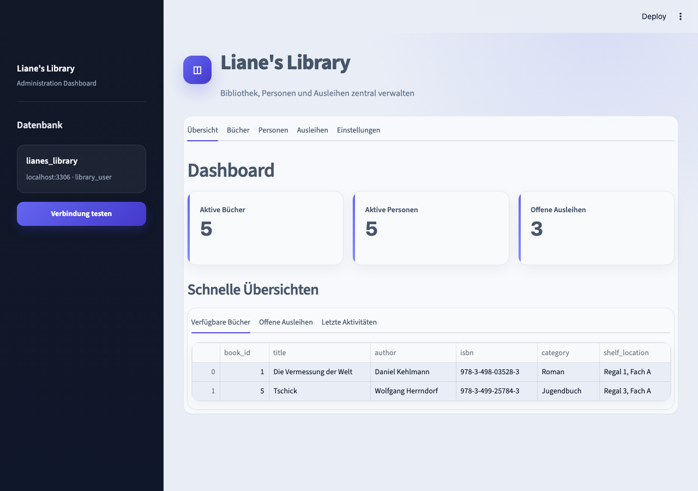
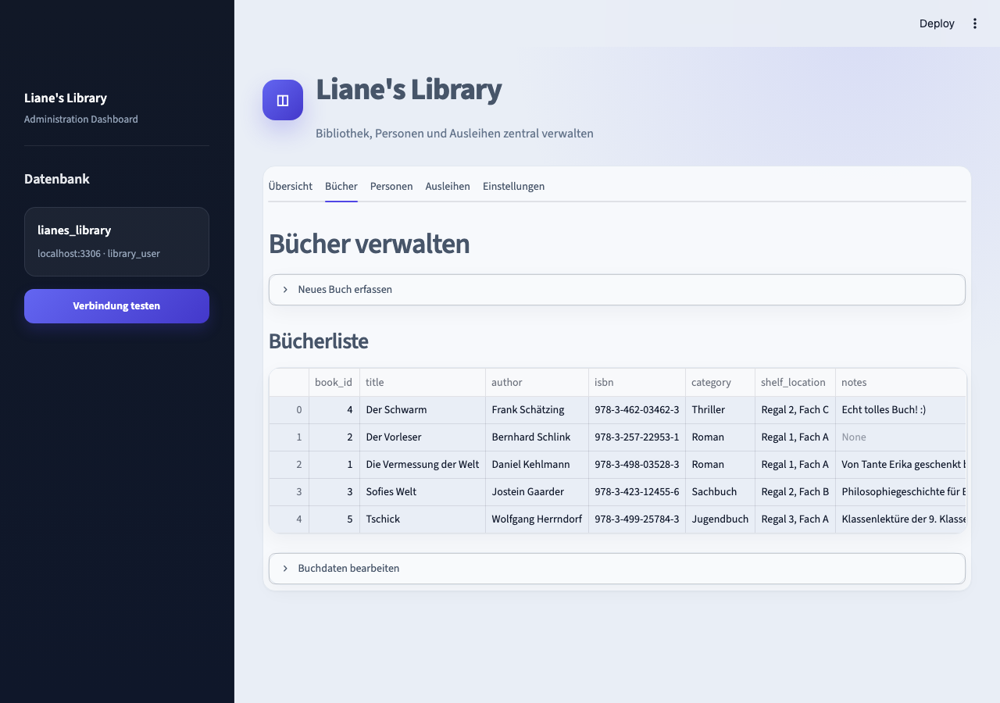

# Liane's Library

Kleine Bibliotheksverwaltung für private Buchsammlungen – wer hat sich was
ausgeliehen, was ist noch da, was ist überfällig. Entstanden ist das Projekt
im Rahmen meiner Weiterbildung als Übung, um Python, SQL und ein einfaches
Web-Deployment einmal komplett von der Datenbank bis zur Oberfläche selbst
durchzuziehen.

Die Anwendung ist bewusst schlank gehalten: ein Streamlit-Frontend, eine
MySQL-Datenbank, dazwischen ein kleines DB-Modul. Kein Framework-Overkill,
dafür lässt sich jeder Teil noch gut nachvollziehen.

## Was die App kann

- **Dashboard** – Kennzahlen auf einen Blick (aktive Bücher, aktive Personen,
  offene Ausleihen) plus Schnellübersichten für verfügbare Bücher, offene
  Ausleihen und die letzten Aktivitäten
- **Bücher verwalten** – Bücher anlegen, bearbeiten und (statt hart zu
  löschen) als inaktiv markieren
- **Personen verwalten** – Ausleiher:innen mit Kontaktdaten und Notiz erfassen
  und pflegen
- **Ausleihen** – Bücher gegen Personen ausleihen, Fälligkeitsdatum setzen,
  Rückgaben erfassen
- **Einstellungen** – Verbindungsstatus zur Datenbank prüfen und das Schema
  bei Bedarf neu initialisieren

## Screenshots

| Dashboard | Bücherverwaltung |
|---|---|
|  |  |

## Projektstruktur

- `environment.yml`: lokale Conda-Umgebung
- `requirements.txt`: Python-Abhängigkeiten für die Conda-Umgebung
- `sql/import.sql`: Datenbankschema und Views
- `sql/testdata.sql`: Beispieldaten für lokale Tests
- `web/app.py`: Streamlit-Anwendung
- `python/db.py`: Datenbankverbindung und Abfragen
- `python/create_schema.py`: Hilfsskript, um das Schema manuell neu anzulegen
- `python/*.ipynb`: Notebooks, in denen ich einzelne SQL-Abfragen und
  Pandas-Auswertungen ausprobiert habe, bevor sie in `db.py` gewandert sind
- `docs/screenshots/`: Screenshots der Anwendung für diese README

## Datenmodell

Drei Tabellen bilden den Kern ab:

- `books` – Titel, Autor:in, ISBN, Kategorie, Standort, Notizen, `is_active`
- `borrowers` – Name, Kontaktdaten, Beziehung zur Person, `is_active`
- `loans` – verknüpft Buch und Person mit Ausleih-, Fällig- und
  Rückgabedatum

Dazu zwei Views, die in der App direkt abgefragt werden:

- `v_open_loans` – aktuell offene Ausleihen inkl. Buch- und Personendaten
- `v_loan_overview` – vollständige Ausleihhistorie für die Übersicht

Bücher und Personen werden nie gelöscht, sondern über `is_active`
deaktiviert – so bleibt die Ausleihhistorie auch nach einer "Löschung"
nachvollziehbar.

## Lokal einrichten

### 1. MySQL bereitstellen

Eine lokal installierte MySQL-Instanz (z. B. über den offiziellen MySQL
Community Server) reicht aus. Schema und Beispieldaten lassen sich bequem
über MySQL Workbench einspielen:

1. Mit dem `root`-Benutzer verbinden.
2. `sql/import.sql` als Skript öffnen und komplett ausführen – legt die
   Datenbank `lianes_library` mit allen Tabellen und Views an.
3. `sql/testdata.sql` genauso ausführen, um Beispieldaten zu laden.
4. Einen eigenen Anwendungsnutzer anlegen, mit dem die App später auf die
   Datenbank zugreift:

   ```sql
   CREATE USER IF NOT EXISTS 'library_user'@'localhost' IDENTIFIED BY 'library_password';
   GRANT ALL PRIVILEGES ON lianes_library.* TO 'library_user'@'localhost';
   FLUSH PRIVILEGES;
   ```

Diese Zugangsdaten entsprechen genau den Standardwerten in `python/db.py`
(`MYSQL_HOST`, `MYSQL_PORT`, `MYSQL_USER`, `MYSQL_PASSWORD`,
`MYSQL_DATABASE` als Umgebungsvariablen, sonst `localhost` / `3306` /
`library_user` / `library_password` / `lianes_library`).

### 2. Conda-Umgebung erstellen

Öffne Anaconda Prompt, Miniconda Prompt oder ein Terminal mit verfügbarem
`conda` im Projektverzeichnis:

```bash
conda env create --file environment.yml
conda activate lianes-lib-env
```

Die Umgebung verwendet Python 3.12 und installiert die Pakete aus
`requirements.txt`. `ipykernel` ist zusätzlich enthalten, damit die Umgebung
auch in Jupyter und VS Code als Kernel ausgewählt werden kann.

### 3. Streamlit starten

```bash
streamlit run web/app.py
```

Die Anwendung ist anschließend unter `http://localhost:8501` erreichbar.
Falls das Schema noch fehlt, bietet die App unter "Einstellungen" auch einen
Button zum Initialisieren an.

### 4. Umgebung später aktualisieren

Nach Änderungen an `environment.yml` oder `requirements.txt`:

```bash
conda env update --file environment.yml --prune
```

### 5. Umgebung beenden

```bash
conda deactivate
```

## Was ich dabei gelernt habe / offene Punkte

- Streamlit eignet sich gut, um ein CRUD-Interface schnell aufzubauen, ohne
  sich vorher mit einem separaten Frontend beschäftigen zu müssen
- Views (`v_open_loans`, `v_loan_overview`) statt komplexer Joins direkt in
  Python zu pflegen, hält `db.py` deutlich übersichtlicher
- Soft-Deletes über `is_active` statt echter `DELETE`-Statements, um die
  Historie nicht zu verlieren
- Noch offen: eine echte Nutzerverwaltung/Login gibt es aktuell nicht – für
  den privaten Gebrauch reicht das, für mehrere Haushalte bräuchte es das
  noch
